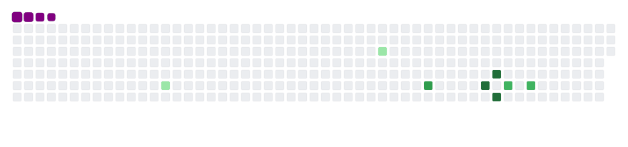
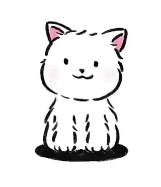

<h1 align="center">Yaqi Duan</h1>

<h3 align="center">Deep learning Learner| Developer | Point Cloud </h3>

 

### 👨🏻‍💻 &nbsp;About Me

  &nbsp;&nbsp;💡 &nbsp;I'm undergraduate student (2020-2023) 
  &nbsp;&nbsp;🎓&nbsp;Enrolled at South China University of Technology, Computer Science - Computer Engineering 
  &nbsp;&nbsp;🌱 I’m interested in Deep Learning , Computer Vision , CUDA , TensorRT 
  &nbsp;&nbsp;🔭&nbsp;Currently learning Deep Learning and working on point cloud upsampling 
  &nbsp;&nbsp;📄 &nbsp;Take a look at my [Curriculum Vitae](https://github.com/DuanYaqi/DuanYaqi/blob/main/DUAN_CV.pdf) for more details about me 
  &nbsp;&nbsp;✉️&nbsp;You can send me an email at duanyaqiduanyaqi@gmail.com! I'll try to answer as soon as possible.

 

### 🛠 &nbsp;Skills
&nbsp; &nbsp; &nbsp;&nbsp;&nbsp; &nbsp;&nbsp; &nbsp; &nbsp;&nbsp;

 

### ⚙️ &nbsp;GitHub Analytics

  
Be Happy!

